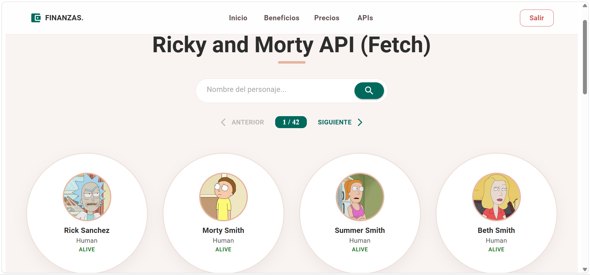
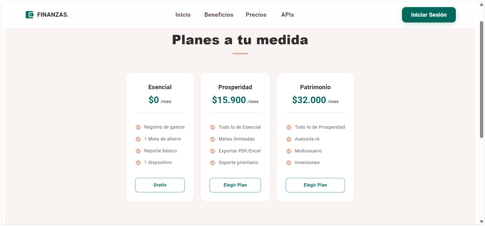

Finanzas - Panel de Gastos

## Descripción y Características Principales

*Finanzas** es una solución integral para la administración de finanzas personales. El sistema permite registrar, categorizar y monitorear ingresos y egresos de manera eficiente, facilitando la toma de decisiones financieras.

  **Control de Movimientos:** Registro detallado de gastos y ganancias con montos y fechas.
  **Gestión Dinámica de Responsables:** Sistema que vincula automáticamente a los usuarios recién registrados con el selector del panel de control.
  **Seguridad:** Módulo de autenticación (Login/Registro) con persistencia de sesión y protección de rutas.
  **Base de Datos en la Nube:** Conexión completa con MongoDB Atlas para el almacenamiento de usuarios y registros.
  **Interfaz Profesional:** Diseño responsivo basado en Material UI con validaciones visuales y formularios optimizados.

## Instalación

Para iniciar un nuevo repositorio y desplegar el proyecto desde cero, sigo estos comandos en la terminal:

1.  **Inicializar el repositorio local:**
    `git init`

2.  **Vincular con el nuevo repositorio de GitHub:**
    `git remote add origin https://github.com/HannahMV-bot/Nombre-De-Tu-Nuevo-Repo.git`

3.  **Instalar las dependencias del proyecto:**
    `npm install`

4.  **Primer guardado y subida:**
    `git add .`
    `git commit -m "Initial commit: Estructura completa de MyFinance App"`
    `git push -u origin main`

## Ejecución

Para poner en marcha la aplicación en un entorno de desarrollo:

1.  **Iniciar el Servidor (Backend):**
    Asegúrese de que el servidor de Node.js esté corriendo (usualmente `node server.js` o `npm run dev`).
2.  **Iniciar la Aplicación (Frontend):**
    Ejecutar el comando `npm start`.
3.  **Acceso:**
    Abrir el navegador en `http://localhost:4000`.

## Tecnologías Utilizadas

  * **Frontend:** React.js y Material UI (MUI).
  * **Navegación:** React Router DOM (v6).
  * **Backend:** Node.js y Express.
  * **Base de Datos:** MongoDB Atlas.
  * **Comunicación:** Axios para consumo de servicios API.
  * **Persistencia:** LocalStorage para gestión de sesiones y listas dinámicas.

## Arquitectura y Encarpetado

El proyecto sigue una estructura modular para facilitar el escalamiento:

  * **src/features/auth:** Componentes de Registro e Inicio de Sesión.
  * **src/features/dashboard:** Lógica del panel de finanzas y selección de responsables.
  * **src/features/layout:** Componentes globales (Header, Footer, Precios y Beneficios).
  * **src/shared/components:** Componentes reutilizables de consumo de API.
  * **AppRoutes.jsx:** Manejo centralizado de rutas, protección de navegación y estados globales.

## Screenshot de la Interfaz Gráfica

## Datos del Autor

  * **Nombre:** HannahMV
  * **Institución:** SENA (Servicio Nacional de Aprendizaje) - Colombia.
  * **Programa:** Análisis y Desarrollo de Software.
  * **GitHub:** [HannahMV-bot](https://www.google.com/search?q=https://github.com/HannahMV-bot)